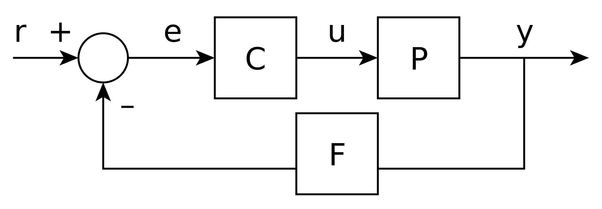

# Control a lazo cerrado

Cuando se tiene una planta, el control a lazo cerrado es la técnica de control en el que la función de transferencia de la planta $G_p$ se retroalimenta con la salida. Por ejemplo, con el arreglo siguiente: 

La función de transferencia puede verse de la siguiente forma: 
$$y(s) = P(s)C(s)e(s)$$
$$e(s) = r(s)-F(s)y(s)$$
$$H(s) = \frac{y(s)}{r(s)} =\frac{P(s)C(s)}{1+F(s)P(s)C(s)} $$
$H(s)$ es conocida como la [[Función de transferencia]] a lazo cerrado del sistema.
