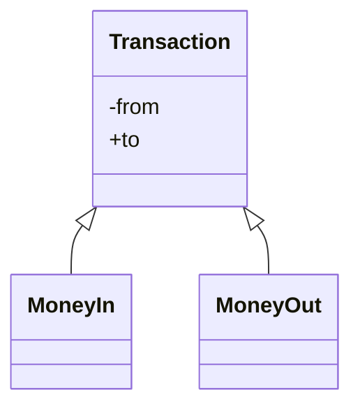
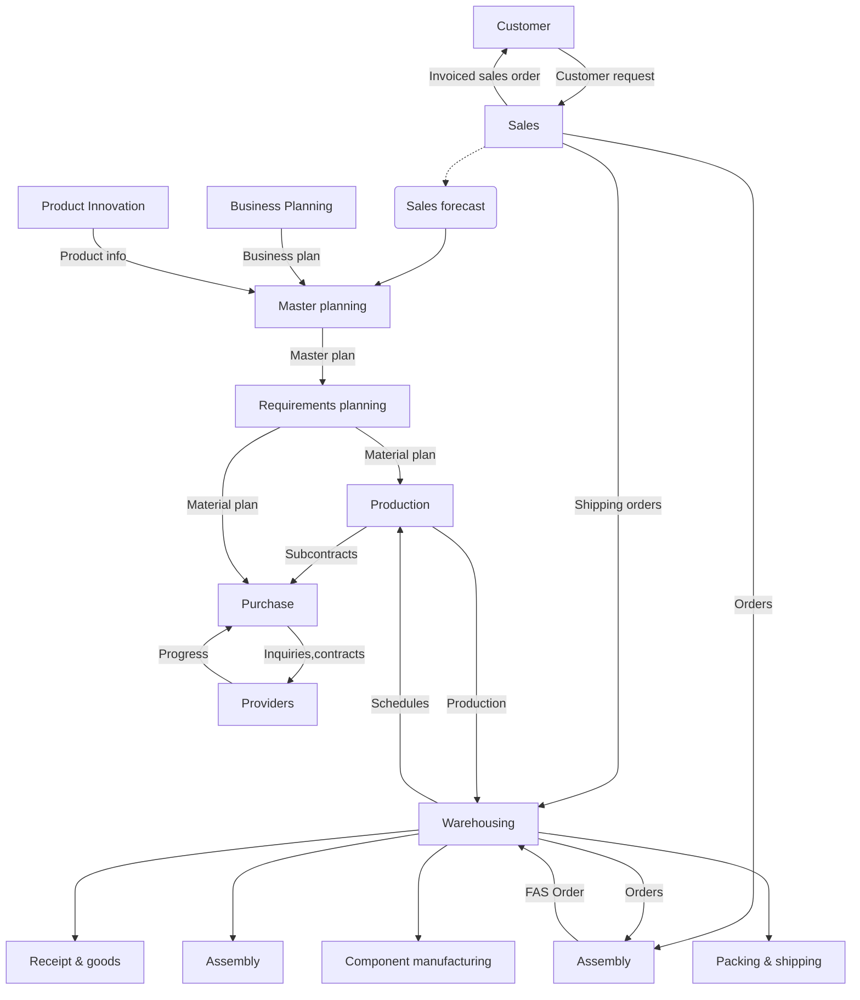

# Diseño básico de ERP

```mermaid
classDiagram
	class Transaction {
		-from
		+to
	}
	class MoneyIn
	
	class MoneyOut

	Transaction<|--MoneyIn
	
	Transaction<|--MoneyOut

```

```mermaid
graph TD;

E(Sales forecast)-->B
A[Business Planning]-->|Business plan|B[Master planning]

C[Product Innovation]-->|Product info|B

B-->|Master plan|D[Requirements planning]

G-->|Subcontracts|F
D-->|Material plan|F[Purchase]

D-->|Material plan|G[Production]

F-->|Inquiries,contracts|H[Providers]

Customer-->|Customer request|S
S-->|Invoiced sales order|Customer
S--->|Shipping orders|I


S[Sales]-->|Orders|J
H-->|Progress|F
G--->|Production|I[Warehousing]
I----->|Schedules|G
I-->|Orders|J[Assembly]


J--->|FAS Order|I
W[Receipt & goods]
X[Assembly]
Y[Component manufacturing]
Z[Packing & shipping]

I--->W
I--->X
I--->Y
I--->Z

S-.->E

```