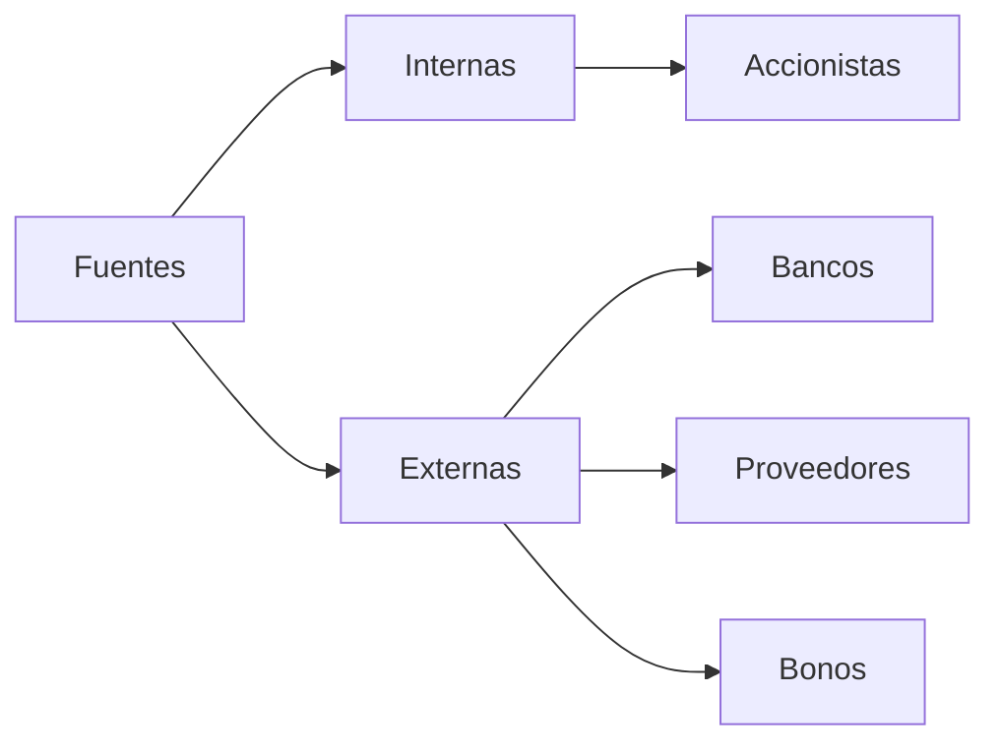

# Empresa

Entidad económica independiente por tener su propia contabilidad, indeendiente de las propiedades de los dueños. 
Posee activos adquiridos

Agentes:
- Accionistas (dependen del desempeño de las empresas)
- Acreedores (no dependen del desempeño de las empresas)

Entonces hay dos fuentes de financiamiento: 
- Internas (importa el desempeño) --> Inversión
	- Accionistas
- Externas (no importa el desempeño) --> Deuda
	- Bancos
	- Proveedores
	- Bonos (pagarés)

Importan tanto las proporciones en las que nos financian como el reisgo que se tolera. 
- Legalmente constituidas como sociedades
	- Personas morales
	- Personas físicas
- Pertenecen a una sola persona -> persona física con actividad empresarial

