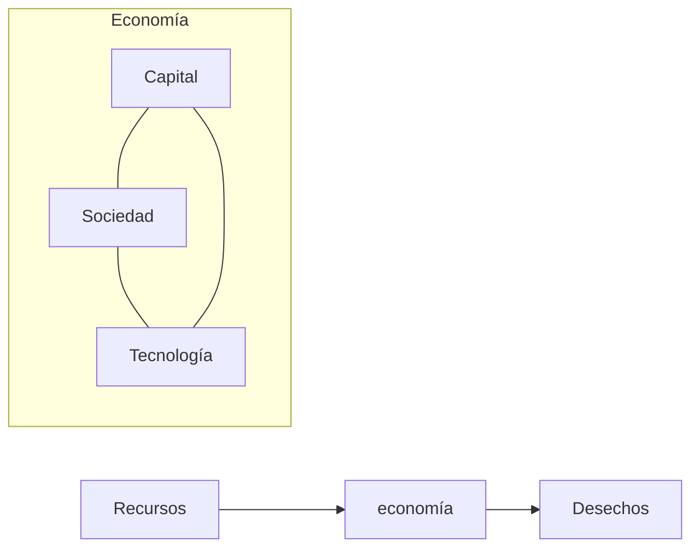

# Gestión ambiental
Conjunto de rutinas y procedimientos que permiten a una organización administrar adecuadamente las relaciones entre sus actividades y el [[Medio ambiente|medio ambiente]] que la rodea, cubriendo las expectativas de las partes interesadas. 

Está muy regida por [[Normas|normas ISO]] para funcionar. 
### Programa de objetivos y metas
- Objetivo del plan estratégico ambiental
- Metas asociadas
- Acciones a ejecutar
	- Cronograma de acciones a desarrollar para cumplir con el programa
- Recursos existentes o nuevos
	- Enumera recursos
- Indicadores
- Control y seguimiento

       