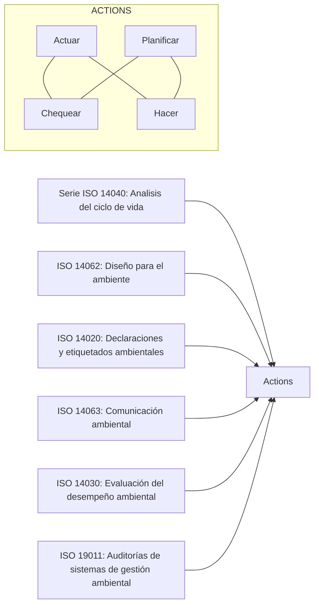

# Normas
Son reglas, especificaciones, atributos, directrices, características o prescripciones aplicables a un producto, proceso, instalación, sistema, actividad

### Ejemplos
- NOM-127-SSA1-1994: Salud [[Ingeniería ambiental|ambiental]]. Agua para uso y consumo humano. Límites permisibles de calidad y tratamientos a que debe someterse el agua para su potabilización.
- NOM-021-SSA1-1993: Salud ambiental. Criterio para evaluar la calidad del aire ambiente con respecto al monóxido de carbono (CO). Valor permisible para la concentración de monóxido de carbono (CO) en el aire ambiente como medida de protección a la salud de la población.
- NOM-087-SSA1-algo: #TODO

## Por qué importan las normas? 
La ausencia de normas se notaría de inmediato, debido a que aumentan los niveles de calidad, seguridad, eficiencia, intercambiabilidad y compatibilidad entre productos, sistemas y procesos. 
### ISO
La *International Organization for Standardization* busca construir varios estándares para mejorar la calidad de muchos procesos. "ISOS": iguales. 
ISO ha desarrollado estándares que ayudan a las organizaciones para administrar problemas ambientales (familia ISO 14000).
ISO ofrece un amplio portafolio de estándares de muestreo y mediciones en la calidad del aire, agua y suelo; en el ruido, radiación, y transporte de materiales peligrosos. 

