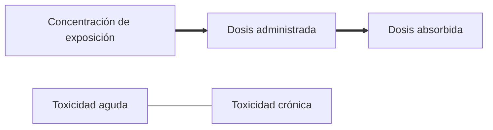

# Toxicología
Estudio de efectos de sustancias químicas en los seres vivos. Por lo general, se suelen clasificar las sustancias químicas como tóxicas o inocuas, pero cualquier sustancia peude ser tóxica en concetnraciones suficientemente altas, medido en  [LD50](https://es.wikipedia.org/wiki/Dosis_letal_media). 
- Efectos que producen los xenobióticos. 
- Enfoque suele ser cualitativo y cuantitativo.

## Ecotoxicología
- Compuestos tóxicos sobre seres vivos, especialment a poblaciones, comunidades y ecosistemas.
- Multidisciplinario; incluye toxicología, ecología y química ambiental.

Mecanismo de toxicidad general:
$$[TOX]\leftrightharpoons[R]$$
### Toxicocinética:
- Absorción: [[difusión]]
- Distribución
- Metabolismo
- Excreción

Otros:

- Mutagénico
- Tóxico
- Acumulativo
### Conceptos básicos

- La dosis hace el veneno

- NOAEL: Nivel sin efectos adversos observados
- DNEL: nivel por encima del cual los humanos no deben estar expuestos
- LOAEL: Nivel más bajo de efectos adversos observados, también conocido como threshold concentration.
 
![[Toxicities]]

### Riesgos ecológicos
- Bioacumulación

### Conceptos relacionados:
[Hórmesis](https://en.wikipedia.org/wiki/Hormesis)