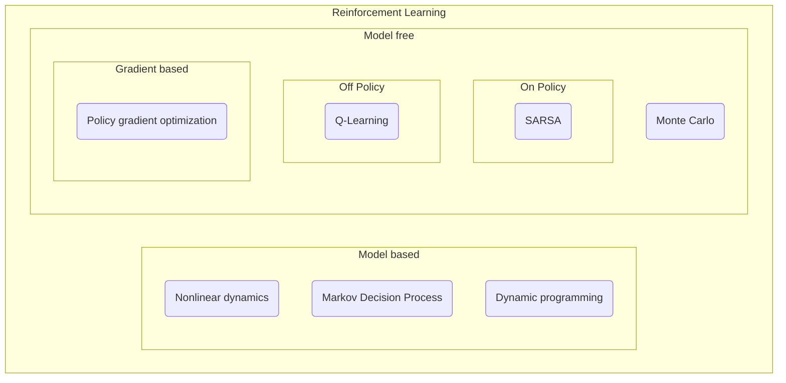

![[Pasted image 20220326185340.png]]

![[Pasted image 20220326185209.png]]

```mermaid

graph LR;
subgraph Reinforcement Learning
	direction LR
	subgraph Model based
		A(Nonlinear dynamics)
		B(Markov Decision Process)
		G(Dynamic programming)
	end
	subgraph Model free
		subgraph On Policy
			D(SARSA)
		end
		subgraph Off Policy
			C(Q-Learning)
		end
		subgraph Gradient based
			F(Policy gradient optimization)
		end
		
		E(Monte Carlo)
	end
end

```