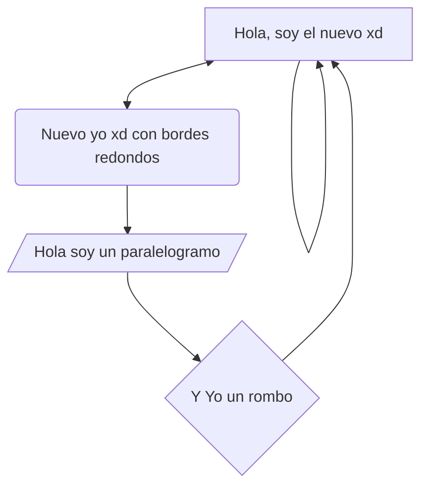
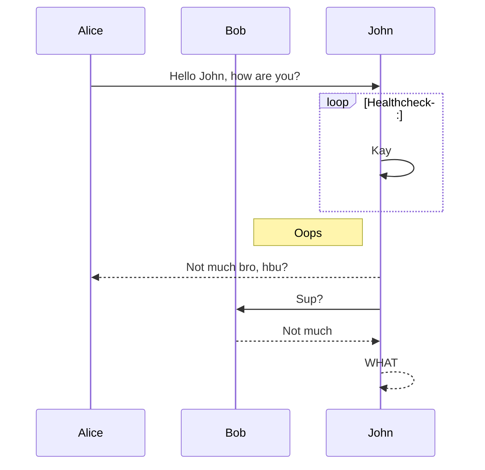
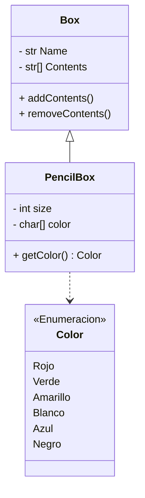

# Notas generales de Mermaid

## Grafo 
### Dirigido
Se usan flechas -->

Existen varios tipos de flechas:



### No dirigido
```mermaid
	graph LR %% LR: Left to right; TD: Top to bottom
		A<-->B--oA; %% Otro tipo de flechas
		A---D; %% No se pone la cabeza, sino guiones
		C-->D-->C;
		D-.->A %% Punteada
		E-->F-->E;
		C-->F-->C;
		E==>B-->E; %% Gruesa
```

## Diagrama UML

