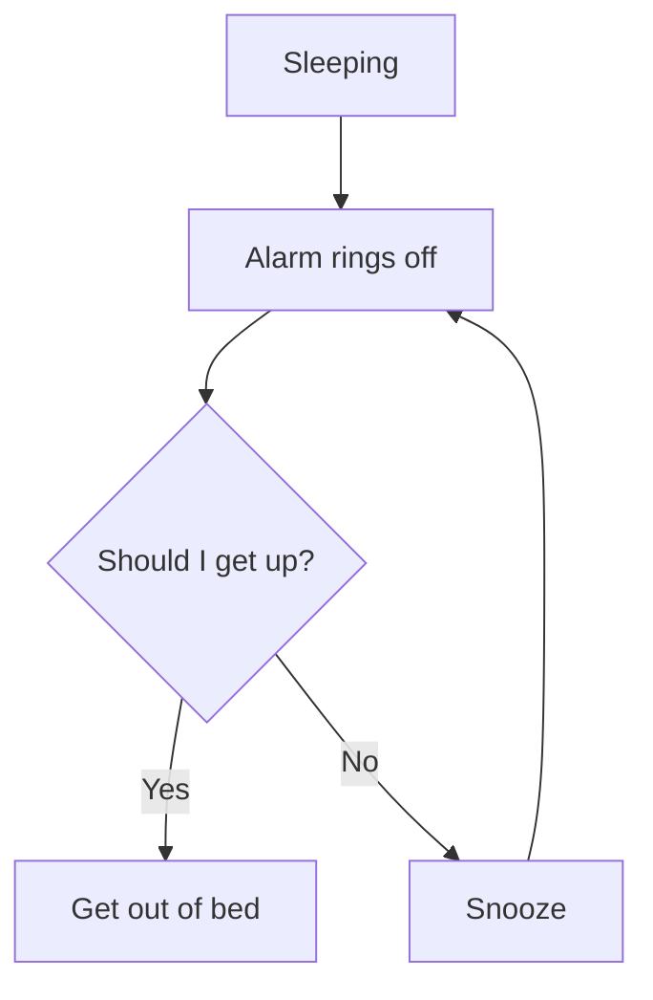
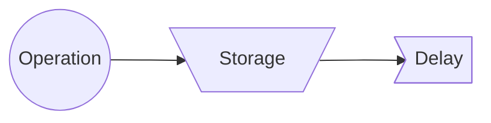

# 7 Tools
1. Flow chart
	1. SIPOC
	2. Regular
2. Histograms
3. Checklist
4. Pareto
5. Dispersion Diagrams
6. Ishikawa/Fishbone/Cause & Effect
7. Statistical process control

### Flowchart

Circle: operation
Triangle: storage
D: Delay
$\Rightarrow$: movement

Quality useful because of its easiness; helps to see right away what's the problem. 
### Checklist
Note what happens in your plant and how often it happens.
For example: 
- [ ] Alarm failed – 9
- [ ] Traffic – 20
- [ ] Sleeping late – 17
- [ ] Parking space – 1
- [ ] Stopped for coffee – 0
- [ ] Said hello to many people – 5 

Startup of reaction usually late

### Pareto charts
- 80-20 rule
- Find major problems
![[ParetoChart.excalidraw]]

### Histograms
Only frequency charts
Check: [[Estimación de densidades|density estimation]]

### Ishikawa
![[Ishikawa]]
Se puede separar en ramificaciones
Por ejemplo: 
- Mano de obra
	- Obrero
	- Controlador
- Medio ambiente
	- Humedad
		- Lluvia
		- Condensación
	- Otros
- Maquinaria
	- Entambadora descalibrada
- MP
	- Tambores de diferente grosor

### Dispersion diagrams
Analysis of two variables: are they correlated or not? 
Do a scatterplot
![[ScatterPlotDiagram]]

### Statitical process control
Define upper (UCL) and lower control limit (LCL) of our process
- This is NOT a specification
- They give us the accepted range of variation due to randomness of the data generating process
![[ControlChart]]

## Six sigma $6\sigma$
### [[Balanced Scorecard]] (BSC)
### Failure Mode Effect Analysis (FMEA)
Used for prevention
### Quality Function Deployment (QFD)
![[QFD]]
