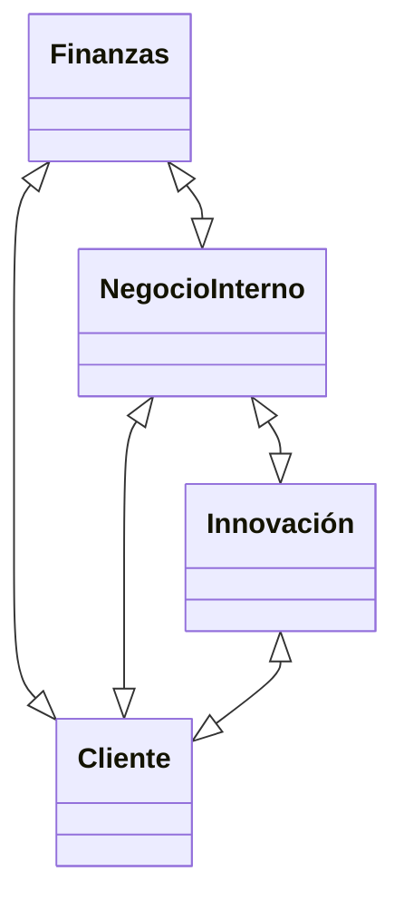

# Balance Score Card

Cuando se desarrollan [[KPI]]s, esta estrategia los divide en cuatro:

En un worksheet tiene los siguientes encabezados: 
1. Dimensión: Finanzas, relación con cliente, producción, innovación y crecimiento
	- Subdimensión: subdivisiones.:
2. Objetivos: ¿Qué se quiere lograr?
3. KPIs
4. Meta del año
5. Resultados al momento del KPI
6. Puntuación (Resultados/meta)
7. Promedio de rendimiento (por subdivisión)