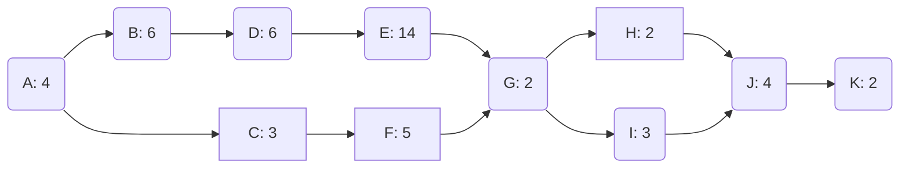

El Critical Path Method, o CPM, es un método de organizar proyectos basado en [[PERT]], donde el tiempo no es probabilístico – es decir, se encuentran bien definidos los tiempos. 

Ruta crítica: $A\rightarrow B\rightarrow D\rightarrow E\rightarrow G\rightarrow I\rightarrow J\rightarrow K$ con duración de $4+6+6+14+2+3+4+2=41$
Rutas: 

|Ruta|Duración|
|----|--------|
| $A\rightarrow B\rightarrow D\rightarrow E\rightarrow G\rightarrow I\rightarrow J\rightarrow K$ | 41 |
| $A\rightarrow B\rightarrow D\rightarrow E\rightarrow G\rightarrow H\rightarrow J\rightarrow K$ | 40 |
| $A\rightarrow  C\rightarrow F \rightarrow G\rightarrow H\rightarrow J\rightarrow K$ | 23 |
| $A\rightarrow  C\rightarrow F \rightarrow G\rightarrow I\rightarrow J\rightarrow K$ | 22 |

Entonces, teniendo estas rutas, se pueden calcular los inicios y fines tempranos y tardíos para cada tarea:

|Nodo|Early Start|Early Finish| Late Start |Late Finish |
|----|-----------|------------|------------|------------|
|  A |     0     |          4 |          0 |          4 |
|  B |         4 |         10 |          4 |         10 |
|  C |         4 |           7|         22 |         25 |
|  D |        10 |         16 |         10 |         16 |
|  E |        16 |         30 |         16 |         30 |
|  F |         7 |         12 |         25 |         30 |
|  G |        30 |         32 |         30 |         32 |
|  H |        32 |         34 |         33 |         35 |
|  I |        32 |         35 |         32 |         35 |
|  J |        35 |         39 |         35 |         39 |
|  K |        39 |         41 |         39 |         41 |
