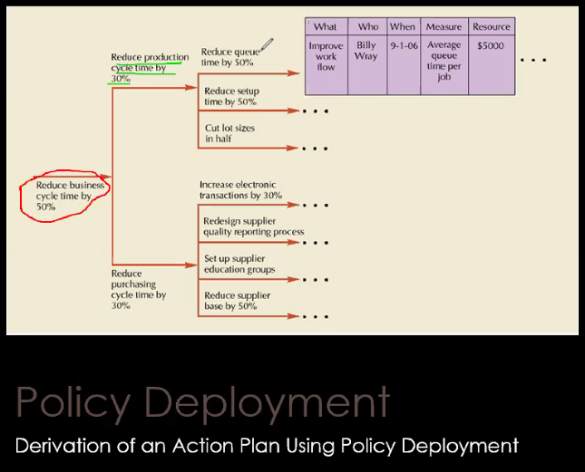

# Hoshins

Estrategia de cambios para aplicar políticas para mejorar partes de la planta. Se reconoce lo posible con [[KPI|KPIs]].
Funciona desglosando las metas. 

Lo desglosa en una tabla de la siguiente manera:

| Qué? | Quién? | Cuándo? | Medida? | Recurso |
|------|--------|---------|---------|---------|
