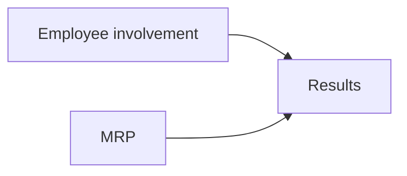
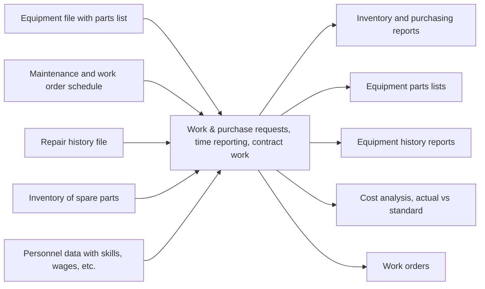

# Mantenimiento y arreglo de plantas

### Importancia estratégica
Fallar tiene implicaciones importantes:
- Operación
- Reputación
- Rentabilidad
- Clientes no satisfechos
- Empleados ociosos
- Ganancias que se vuelven pérdidas
- Valor reducido de los activos
***NO reduzcan mantenimiento si deben reducirse costos***

### Mantenimiento y confiabilidad

- Mantener operando al sistema cuidando los costos
- Se refiere a todas las actividades involucradas en mantener el equipo de un sistema en orden y operando
- Confiabilidad es la probabilidad de que un equipo funcione en forma adecuada por un tiempo especificado [[Seguridad|(SIL 3)]]

### Tácticas importantes
- Confiabilidad
	- Mejorar componentes individuales
	- Redundancia
- Mantenimiento
	- Implementar o mejorar el mantenimiento preventivo
	- Aumentar la capacidad o velocidad de una reparación

### Procedimientos necesarios
- Ingreso a equipos confinados como tanques, calderas, reactores, etc. 
- Trabajos que impliquen energía eléctrica
- Trabajos que impliquen fuego
	- Barreras (lona)
	- Que no esté sola la gente
	- EPP
		- Careta
		- Guantes de carnaza
- Entrega correcta de equipos de producción a mantenimiento y viceversa.
	- Checklists; se conoce como procedimiento de entrega y recepción de equipo.
- Trabajos en alturas
- Colocación de candados en los centros de control de motores para evitar que un operador ponga a funcionar accidentalmente un equipo que se está interviniendo por mantenimiento
- Llenado de un permiso de trabajo cada vez que se va a intervenir un equipo. Este debe ser del conocimiento del personal que opera el equipo, de mantenimiento y seguridad y estar colocado en un lugar visible durante todo el trabajo
- Etiquetado adecuado de equipos fuera de servicio.

### Estrategia y resultados
Employee involvement:
- Information sharing, 
- Skill training, 
- Reward system, 
- Power sharing

Maintenance and reliability procedures: 
- Clean, lubricate, 
- Monitor, adjust, 
- Minor repair, 
- Computerize records

Results:
- Reduced inventory
- Improved quality
- Improved capacity
- Reputation for quality
- Continuous improvement
- Reduced variability

## Tipos de mantenimiento
- Preventivo: Inspecciones y servicios de rutina para mantener los equipos en buen estado
- Correctivo: Reparaciones de emergencia en equipo que falló
- Productivo o predictivo: Implica desde el diseño 

### Implementando mantenimiento preventivo
Se requieren dos datos importantes:
- Costo de falla: cuánto cuesta a la planta si falla un equipo
	- Tienen que ver todos los costos
	- Muchos de los costos de falla los evito
- Costo de mantenimiento: cuánto cuesta darle mantenimiento a un equipo. 
- Estadística histórica de las fallas del equipo ([[Matriz de covarianza|desviación estándar]])
Si no se tiene el histórico de fallas, se confía en lo que dice el proveedor o en equipo similar.
- Necesario saber cuándo se requiere un servicio o es factible que falle el equipo.
- Las fallas iniciales altas se conocen como mortandad infantil.
- Es importante tener buenos reportes y registros para tomar la decisión de cuándo se debe dar un mantenimiento.
- Se puede calcular el tiempo de mantenimiento preventivo requerido antes de que ocurra una falla
- Se utilizan las distribuciones de fallas. 
- ¿Cuál es el tiempo de mantenimiento preventivo para un equipo que en promedio falla cada 3 semanas con una desviación estándar de 0.6 semanas?
	- $\frac{C_m}{C_f}=\frac{325}{1000}=0.325$
	- Se busca el número de desviaciones correspondientes al valor que se obtiene de restar 0.5 - 0.325; es decir: 0.175. El valor que se obtiene de z es 0.455.
	- Tiempo: Promedio - z desviaciones, en este caso: $3-0.455\cdot0.6=2.73$ semanas. 
- Si la razón de costo de mantenimiento a costo de paro es mayor a 0.5 y menor a 0.75 el mantenimiento se planea justo en el promedio de falla. Si el valor es mayor, se prefiere cotizar un nuevo equipo.

Sistema computarizado de mantenimiento: 

- Tradicionalmente se trataba de balancear los costos de mantenimiento preventivo y correctivo
- No tomaba en cuenta muchos de los costos de un paro de planta
	- Inventario
	- Clima laboral
	- Programar a la no confiabilidad

### Aumentando la capacidad de reparación
- Personal bien capacitado
- Recursos adecuados 
- Posibilidad de crear un plan y dar prioridades
- Autoridad para planear amteriales

### Cómo se da el mantenimiento
Operador --> Departamento de mantenimiento --> Servicio técnico del proveedor --> Devolución de equipos

A la derecha es mayor la capacidad, pero el costo y velocidad de respuesta también. 

## Mantenimiento total productivo
- Diseñando máquinas que son confiables, fáciles de operar y de mantener.
- Enfatiza el costo total de ser dueños del equipo para incluir costos de servicio y mantenimiento. 
- Desarrolla planes de mantenimiento preventivo que usan las mejores prácticas de operadores, departamento de mantenimiento y servicio externo.
- Entrena a los operadores para mantener sus equipos.

### Políticas de mantenimiento

- Simulación 
	- Análisis de situaciones complejas con computadora.
	- Simulación de programas de mantenimiento antes de implementarlos.
- Sistemas expertos
	- Ayudan a identificar problemas y cómo resolverlos.

## Diseñando arreglo de procesos
- Objetivo
	- Minimizar el costo de manejo de materiales
- Diagrama de bloques
	- Minimizar cargas no adyacentes.
	- Se usa cuando hay datos cuantitativos.
- Diagrama de relación
	- Se usa sin datos cuantitativos.
	- Basado en preferencia de localización entre dos áreas. 

### Diagrama de bloques
- Carga unitaria: cantidad en la que se mueve normalmente el material.
- Carga no adyacente: Distancia mayor al siguiente bloque

Pasos:
- Crear un diagrama de resumen de cargas
- Calcular movimientos de ida y vuelta
- Desarrollar arreglos de prueba

### Diagrama de relaciones
![[DiagramaRelaciones]]

