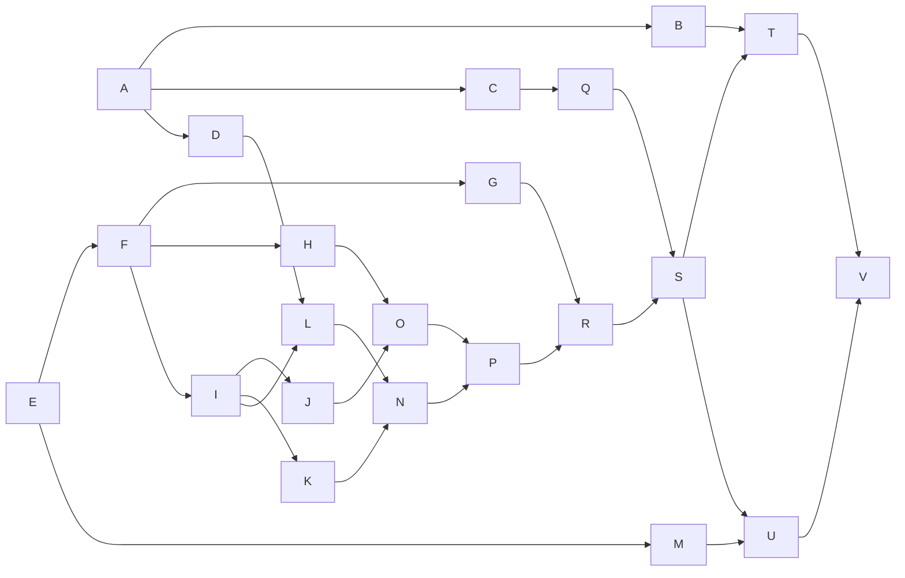

# Project Evaluation R T

Para calcular los tiempos de actividad, se usan estimaciones "probabilísticas" para dar un tiempo estimado, con la siguiente fórmula: 

$$t_{act} = \frac{t_o+4t_r+t_p}{6}$$
Donde $t_{act}$ es el tiempo de actividad, $t_o$ es el tiempo optimista, $t_r$ es el tiempo realista, y $t_p$ es el tiempo pesimista. Se hace de esta manera para darle un estimado con forma similar a la curva de distribución normal. 




``` mermaid
graph LR;
A-->B
A-->C
B-->D
C-->E
D-->F
E-->D

 ```