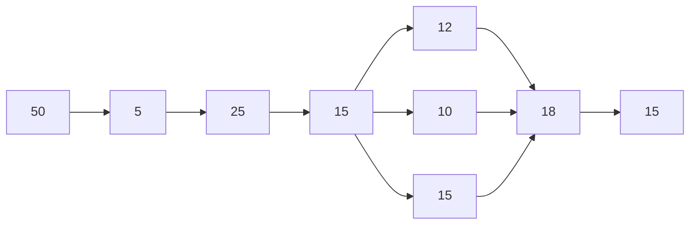

Tiempo total: 165 s

Si se divide en 3 personas se puede hacer en 1 min
Balanceo de línea: 
Persona 1 hace A y B; Persona 2 hace C,D y F, y persona 3 hace E, H e I.


```mermaid

graph LR;
A[Tanque: 50 m]-->

```