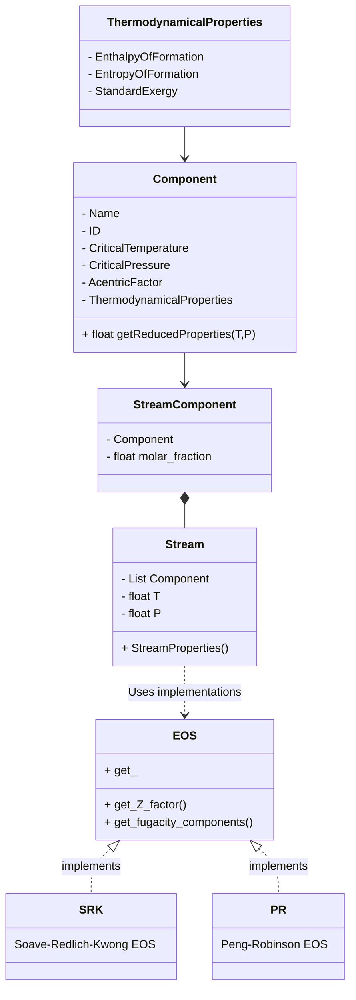

```mermaid
classDiagram

class EOS {
+ get_Z_factor()
+ get_fugacity_components()
+ get_
}

class SRK {
Soave-Redlich-Kwong EOS
}
class PR {
Peng-Robinson EOS
}

class Component {
- Name
- ID
- CriticalTemperature
- CriticalPressure
- AcentricFactor
- ThermodynamicalProperties
+ float getReducedProperties(T,P)
}

class StreamComponent {
- Component
- float molar_fraction
}

class ThermodynamicalProperties {
- EnthalpyOfFormation
- EntropyOfFormation
- StandardExergy
}

class Stream {
- List Component
- float T
- float P
+ StreamProperties()
}

StreamComponent *--Stream
EOS<|..SRK: implements
EOS<|..PR: implements
Stream..>EOS : Uses implementations
ThermodynamicalProperties-->Component
Component-->StreamComponent

```